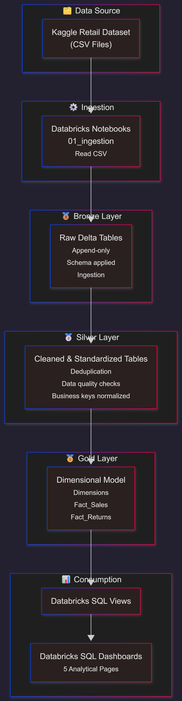

# Retail & E-Commerce Analytics Platform
**An end-to-end Retail & E-Commerce analytics platform built on Databricks using the
Medallion Architecture (Bronze, Silver, Gold)**  

---

## 📌 Table of Contents
- [Project Overview](#project-overview)
- [Project Objectives](#project-objectives)
- [Tech Stack](#tech-stack)
- [Architecture](#architecture)
- [Medallion Architecture](#medallion-architecture)
- [Business Metrics & Analytics](#business-metrics--analytics)
- [Discount Handling Logic](#discount-handling-logic)
- [Dashboards](#dashboards-databricks-sql)
- [Key Design Decisions](#key-design-decisions)
- [Execution Flow](#execution-flow)
- [Repository Structure](#repository-structure)
- [Future Enhancements](#future-enhancements)
- [Conclusion](#conclusion)

---

## Project Overview

This project implements an end-to-end Retail & E-Commerce analytics platform using
Databricks and Delta Lake, following the Medallion Architecture (Bronze, Silver, Gold).

Raw retail data is ingested from CSV files, processed through structured data
pipelines, and transformed into analytics-ready fact and dimension tables using a
star schema design. The Gold layer is optimized for analytical workloads and serves
as the foundation for business intelligence and reporting.

The platform enables analysis of sales performance, product and store behavior,
return trends, and discount effectiveness. Special attention is given to real-world
data engineering constraints such as separating sales and returns into independent
fact tables, avoiding fact-to-fact joins, and handling time-bound discounts.

Final insights are delivered through Databricks SQL dashboards, providing
decision-ready metrics for business and operational stakeholders.

---

## Project Objectives

- Build a scalable analytics pipeline using Databricks & Delta Lake
- Apply industry-standard Medallion Architecture
- Design a dimensional (star schema) data model
- Analyze sales, returns, discounts, and operational performance
- Deliver BI-ready datasets and dashboards
- Follow real-world data engineering design constraints

---

## Tech Stack

| Category | Technology |
|--------|------------|
| Processing | Apache Spark (PySpark) |
| Storage | Parquet / Delta Lake |
| Analytics | Databricks SQL |
| Visualization | Databricks Dashboards |
| Version Control | Git & GitHub |

---

## Architecture



### High-Level Flow

**Source → Bronze → Silver → Gold → Dashboards**

- **Source**: Kaggle retail CSV files
- **Processing**: PySpark on Databricks
- **Storage**: Delta Lake
- **Modeling**: Star Schema (Facts & Dimensions)
- **Consumption**: Databricks SQL Dashboards

Detailed architecture documentation is available in:  
`docs/architecture.md`

---

## Medallion Architecture

### Bronze Layer – Raw Ingestion

**Purpose**
- Preserve raw source data
- Add ingestion metadata
- Enable reprocessing

**Characteristics**
- Minimal transformations
- Schema applied (no business logic)
- Append-only pattern

**Datasets**
- customers
- products
- stores
- employees
- discounts
- transactions

---

### Silver Layer – Cleaned & Enriched

**Purpose**
- Improve data quality
- Apply business-level cleaning
- Prepare data for modeling

**Key Transformations**
- Column standardization
- Data type casting
- Null handling
- Deduplication
- Business key normalization

Silver tables act as the **single source of truth** for Gold modeling.

---

### Gold Layer – Analytics

The Gold layer is modeled using a **Star Schema**, optimized for BI workloads.

#### Dimension Tables
- `dim_dates`
- `dim_customers`
- `dim_products`
- `dim_stores`
- `dim_employees`
- `dim_discounts`

All dimensions use **surrogate keys**.

#### Fact Tables
- `fact_sales`
  - Contains only completed sales
  - Grain: one row per product per transaction
- `fact_returns`
  - Contains only returned items
  - Grain: one row per returned product per transaction

Detailed modeling explanation:  
`docs/data_model.md`

---

## Business Metrics & Analytics

Key metrics enabled by the Gold layer:

- Total Revenue
- Total Quantity Sold
- Total Quantity Returned
- Quantity-Based Return Rate
- Discount Contribution to Sales
- Store Performance
- Employee Performance

### Important Design Choice
- **Return Rate is quantity-based**, not revenue-based
- **No fact-to-fact joins** are used
- Returns are analyzed independently for scalability and clarity

---

## Discount Handling Logic

- Discounts are **time-bound**
- A discount is applied if the transaction date falls within the discount validity window
- For returns analysis, discounts are **approximated** based on original transaction context

This approach balances analytical accuracy with real-world data constraints.

---

## Dashboards (Databricks SQL)

Dashboards are built using Databricks SQL and organized into five pages:

1. Executive Overview
2. Sales Performance
3. Returns Analysis
4. Discount Effectiveness
5. Operational Insights

Dashboard artifacts:  
`sql/dashboard/`

---

## Key Design Decisions

- Medallion Architecture for scalability and maintainability
- Separate fact tables for sales and returns
- Conformed dimensions shared across facts
- Avoided complex joins for BI performance
- Business-friendly, analytics-first data model

---

## Execution Flow

Follow the steps mentioned in the document to run the project end-to-end.

📄 Refer to:  
`docs/pipeline_flow.md`

---

## Repository Structure
```

retail-ecommerce-analytics-platform/
│
├── data/
│     ├── raw/ # Original CSV data sample (Kaggle)
│     ├── bronze/ # Sample Bronze outputs
│     ├── silver/ # Sample Silver outputs
│     └── gold/ # Sample dimension & fact tables
│
├── notebooks/
│     ├── 00_setup/
│     ├── 01_ingestion/
│     ├── 02_bronze/
│     ├── 03_silver/
│     └── 04_gold/
│
├── src/
├── sql/
├── docs/
│
└── .gitignore
└── .env.example
└── CONTRIBUTING.md
└── LICENSE
└── README.md


```

---

## Future Enhancements

- Slowly Changing Dimensions (SCD Type 2)
- Incremental ingestion using Auto Loader
- Unity Catalog for governance
- ML-based return prediction
- RAG-based analytics on Gold tables

---

## Conclusion

This project demonstrates:
- Strong **data engineering fundamentals**
- Clean **analytics and visualization design**
- Production-style **data modeling and architecture thinking**
