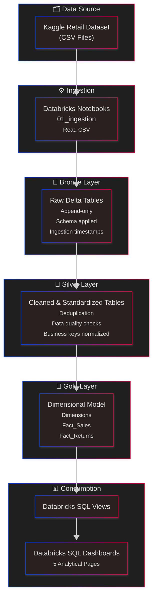

```mermaid
---
config:
  theme: neo-dark
  layout: fixed
  look: neo
---
flowchart TB
 subgraph SOURCE["🗂️ Data Source"]
        A["Kaggle Retail Dataset<br>(CSV Files)"]
  end
 subgraph INGESTION["⚙️ Ingestion"]
        B["Databricks Notebooks<br>01_ingestion<br><small>Read CSV</small>"]
  end
 subgraph BRONZE["🥉 Bronze Layer"]
        C["Raw Delta Tables<br><small>Append-only<br>Schema applied<br>Ingestion timestamps</small>"]
  end
 subgraph SILVER["🥈 Silver Layer"]
        D["Cleaned &amp; Standardized Tables<br><small>Deduplication<br>Data quality checks<br>Business keys normalized</small>"]
  end
 subgraph GOLD["🥇 Gold Layer"]
        E["Dimensional Model<br><small>Dimensions<br>Fact_Sales<br>Fact_Returns</small>"]
  end
 subgraph CONSUMPTION["📊 Consumption"]
        F["Databricks SQL Views"]
        G["Databricks SQL Dashboards<br><small>5 Analytical Pages</small>"]
  end
    A --> B
    B --> C
    C --> D
    D --> E
    E --> F
    F --> G
```