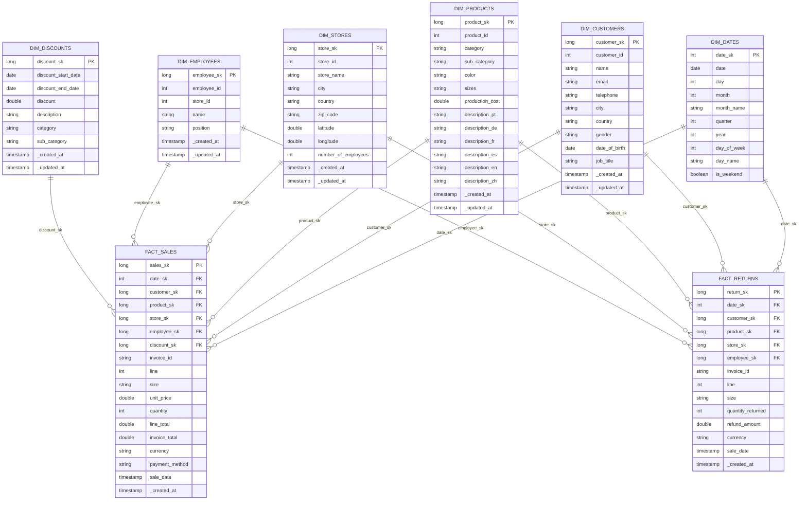

```mermaid
erDiagram

      DIM_DATES {
          int date_sk PK
          date date
          int day
          int month
          string month_name
          int quarter
          int year
          int day_of_week
          string day_name
          boolean is_weekend
      }

      DIM_CUSTOMERS {
          long customer_sk PK
          int customer_id
          string name
          string email
          string telephone
          string city
          string country
          string gender
          date date_of_birth
          string job_title
          timestamp _created_at
          timestamp _updated_at
      }

      DIM_PRODUCTS {
          long product_sk PK
          int product_id
          string category
          string sub_category
          string color
          string sizes
          double production_cost
          string description_pt
          string description_de
          string description_fr
          string description_es
          string description_en
          string description_zh
          timestamp _created_at
          timestamp _updated_at
      }

      DIM_STORES {
          long store_sk PK
          int store_id
          string store_name
          string city
          string country
          string zip_code
          double latitude
          double longitude
          int number_of_employees
          timestamp _created_at
          timestamp _updated_at
      }

      DIM_EMPLOYEES {
          long employee_sk PK
          int employee_id
          int store_id
          string name
          string position
          timestamp _created_at
          timestamp _updated_at
      }

      DIM_DISCOUNTS {
          long discount_sk PK
          date discount_start_date
          date discount_end_date
          double discount
          string description
          string category
          string sub_category
          timestamp _created_at
          timestamp _updated_at
      }

      FACT_SALES {
          long sales_sk PK
          int date_sk FK
          long customer_sk FK
          long product_sk FK
          long store_sk FK
          long employee_sk FK
          long discount_sk FK
          string invoice_id
          int line
          string size
          double unit_price
          int quantity
          double line_total
          double invoice_total
          string currency
          string payment_method
          timestamp sale_date
          timestamp _created_at
      }

      FACT_RETURNS {
          long return_sk PK
          int date_sk FK
          long customer_sk FK
          long product_sk FK
          long store_sk FK
          long employee_sk FK
          string invoice_id
          int line
          string size
          int quantity_returned
          double refund_amount
          string currency
          timestamp sale_date
          timestamp _created_at
      }

      %% Relationships – FACT_SALES
      DIM_DATES ||--o{ FACT_SALES : date_sk
      DIM_CUSTOMERS ||--o{ FACT_SALES : customer_sk
      DIM_PRODUCTS ||--o{ FACT_SALES : product_sk
      DIM_STORES ||--o{ FACT_SALES : store_sk
      DIM_EMPLOYEES ||--o{ FACT_SALES : employee_sk
      DIM_DISCOUNTS ||--o{ FACT_SALES : discount_sk

      %% Relationships – FACT_RETURNS
      DIM_DATES ||--o{ FACT_RETURNS : date_sk
      DIM_CUSTOMERS ||--o{ FACT_RETURNS : customer_sk
      DIM_PRODUCTS ||--o{ FACT_RETURNS : product_sk
      DIM_STORES ||--o{ FACT_RETURNS : store_sk
      DIM_EMPLOYEES ||--o{ FACT_RETURNS : employee_sk
```